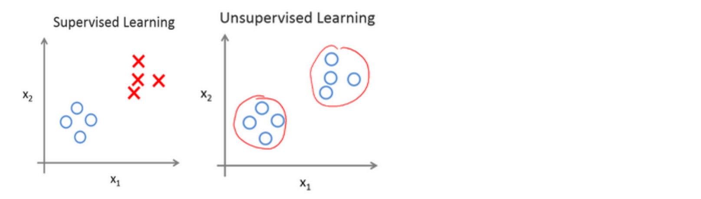
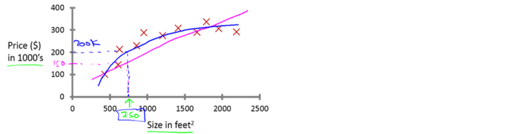
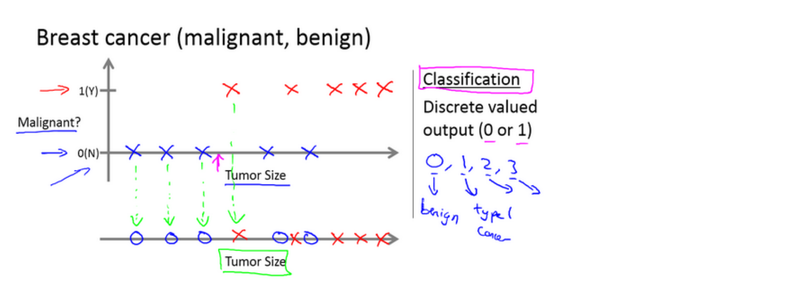
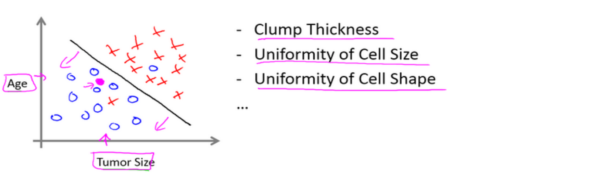
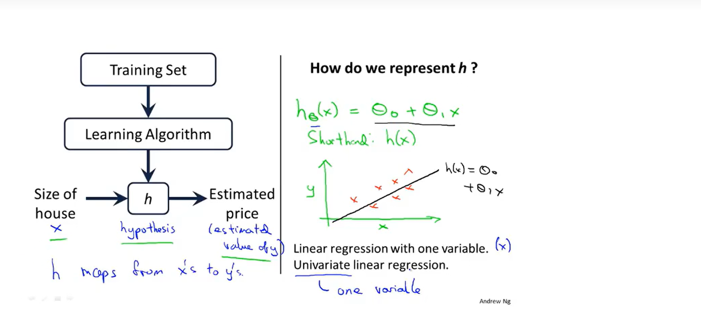
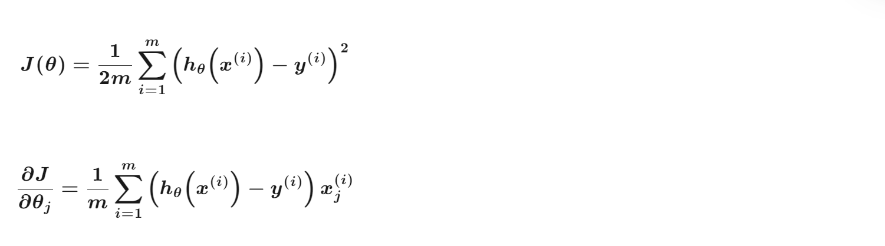
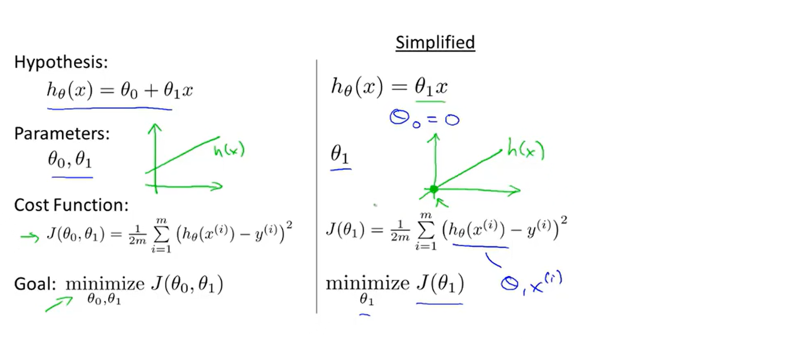
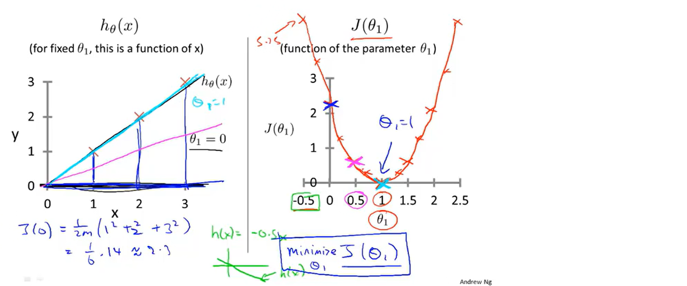

# Introduction
machine learning algorithms: 
supervised learning <-> unsupervised learning

## 📌 supervised learning
input-> output label 
learn from being given "right answers"

applications using supervised learning:

| Input (X)         | Output (Y)             | Application         |
| ----------------- | ---------------------- | ------------------- |
| email             | spam? (0/1)            | **spam filtering**      |
| audio             | text transcripts       | speech recognition  |
| English           | Spanish                | machine translation |
| ad, user info     | click? (0/1)           | online advertising  |
| image, radar info | position of other cars | self-driving car    |
| image of phone    | defect? (0/1)          | visual inspection   |

examples: 
1. housing price prediction: 
whether to fit a straight line, a curve or another function to the data

**regression**: predict numbers / continuous valued output

2. breast cancer detection: 

**classification**: predict categories / discrete valued output

the examples above only provide one input or feature, in fact, more than one feature also works 

find a boundary line 
we use **SVM(Support Vector Machine)** when we have infinite numbers of features

## 📌 unsupervised learning
find the structure or pattern by itself in unlabeled data

**clustering**: group data into different clusters

examples: 
1. google news: 
find the acticles with similar words and group them into the same cluster
this is used in Recommender Systems, recommend related articles in the same cluster

2. Cocktail Party Algorithm: 
for knowing only 
a typical problem of BSS(Blind Source Separation), solving by ICA or Sparse Coding)

# Linear Regression with One Variable
## 📌 model
example: housing price prediction

m: number of training examples 
x: input(feature) 
y: output(target/label) 
(x, y): one training example 
(x⁽ⁱ⁾, y⁽ⁱ⁾): the ith training example 
h: function of the model(f(x))

so the model is like below:

## 📌 cost function 
after setting up our model, we need to choose the reasonable parameters: θo and θ1

what means reasonable? --- minimize the modeling error between predicted output and real output

we use **cost funtion** to measure the error

the cost function, also called "the square error function", uses the **least squares method**

m is for averaging, making the function independent of the sample size; 
2 is to ensure that the gradient grad after differentiation has no extra coefficients, which cancel out of the square 2

to better visualize the function, let's simplify it first:

