# Content
- [Introduction](#introduction)
  - [📌 supervised learning](#-supervised-learning)
  - [📌 unsupervised learning](#-unsupervised-learning)
- [Linear Regression with One Variable](#linear-regression-with-one-variable)
  - [📌 model](#-model)
  - [📌 cost function for Linear Regression with One Variable](#-cost-function-for-linear-regression-with-one-variable)
  - [📌 gradient decent](#-gradient-decent)
- [Linear Algebra](#linear-algebra)
- [Linear Regression with Multiple Variables](#linear-regression-with-multiple-variables)
  - [📌 model](#-model-1)
  - [📌 cost function and gradient decent](#-cost-function-and-gradient-decent)
  - [📌 feature scaling](#-feature-scaling)
  - [📌 polynomial regression](#-polynomial-regression)
  - [📌 normal equation](#-normal-equation)
- [Logistic Regression](#logistic-regression)
  - [📌 hypothesis function](#-hypothesis-function)
  - [📌 decision boundary](#-decision-boundary)
  - [📌 cost function for Logistic Regression](#-cost-function-for-logistic-regression)
  - [📌 advanced optimization](#-advanced-optimization)
  - [📌 multiclass classification](#-multiclass-classification)
- [Regularization](#regularization)
  - [📌 the problem of overfitting](#-the-problem-of-overfitting)
  - [📌 cost function for Regularization](#-cost-function-for-regularization)
  - [📌 regularized Linear Regression](#-regularized-linear-regression)
  - [📌 regularized Logistic Regression](#-regularized-logistic-regression)

# Introduction
machine learning algorithms:<br>
supervised learning <-> unsupervised learning


## 📌 supervised learning
input-> output label<br>
learn from being given "right answers"

applications using supervised learning:

| Input (X)         | Output (Y)             | Application         |
| ----------------- | ---------------------- | ------------------- |
| email             | spam? (0/1)            | **spam filtering**      |
| audio             | text transcripts       | speech recognition  |
| English           | Spanish                | machine translation |
| ad, user info     | click? (0/1)           | online advertising  |
| image, radar info | position of other cars | self-driving car    |
| image of phone    | defect? (0/1)          | visual inspection   |

examples:<br>
1. housing price prediction:<br>
whether to fit a straight line, a curve or another function to the data

✅ **regression**: predict numbers / continuous valued output

2. breast cancer detection:<br>

✅ **classification**: predict categories / discrete valued output

the examples above only provide one input or feature, in fact, more than one feature also works<br>

find a boundary line<br>
✅ we use **SVM(Support Vector Machine)** when we have infinite numbers of features

## 📌 unsupervised learning
find the structure or pattern by itself in unlabeled data

✅ **clustering**: group data into different clusters

examples:<br>
1. google news:<br>
find the acticles with similar words and group them into the same cluster
this is used in Recommender Systems, recommend related articles in the same cluster

2. Cocktail Party Algorithm:<br>
for knowing only<br>
a typical problem of BSS(Blind Source Separation), solving by ICA or Sparse Coding)

# Linear Regression with One Variable
## 📌 model
example: housing price prediction

m: number of training examples<br>
x: input(feature)<br>
y: output(target/label)<br>
(x, y): one training example<br>
(x⁽ⁱ⁾, y⁽ⁱ⁾): the ith training example<br>
h: function of the model(f(x))

so the model is like below:


## 📌 cost function for Linear Regression with One Variable
after setting up our model, we need to choose the reasonable parameters: θo and θ1

what means reasonable? --- minimize the modeling error between predicted output and real output

we use **cost funtion**(代价函数) to measure the error


✅ the cost function, also called "the square error function"(均方误差函数), uses the **least squares method**(最小二乘法)

m is for averaging, making the function independent of the sample size;<br>
2 is to ensure that the gradient grad after differentiation has no extra coefficients, which cancel out of the square 2

to better visualize the function, let's simplify it first:


if we have two parameters, the picture would look like this :

in three-dimensional space, we can still find the lowest point


to automatically find the parameters that minimize the cost function J, we introduce gradient decent

## 📌 gradient decent
✅ **gradient decent**(梯度下降) is used to minimize some arbitrary funciton

imagine you are on a hill, to go down the hill as quickly as possible, you need to look around and find the best direction then take a step.<br>
Then you keep going, from this new point you are now standing at, look around and find the best direction then take another step...

starting with different points of the hill, you'll end up with different local minimum / `local optimum`(局部最小值/局部最优解)

here is the visualized picture:


here is the algorithm:


something you need to know in the algorithm:<br>
1. derivative term(导数项)


the derivative term will be smaller and smaller

2. α is learning rate, it controls how big a step we take<br>

you can try 0.001, 0.01, 0.1, 1...

3. if you don't update simultaneous(同步更新), say you update θo first, then when you update θ1, now θo in J(θo, θ1) will be the updated θo, and this is incorrect
4. what if you are already on the minimum point at first?


now let's see how to use grdient decent to minimize the cost function J:

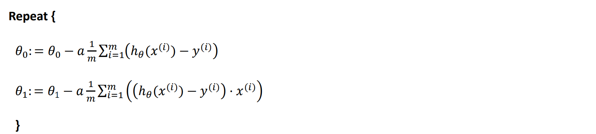

don't worry about getting the local optimum, cause the cost function is always a bow shape<br>
there is only a single optimum, that is the global optimum(全局最优解)


as for this picture we see before, the right one is a Contour map(等值线图), every point on the same circular line has the same cost<br>
as the point goes closer and closer to the center point(minimum cost), the cost becomes smaller, and the line on the left picture better fit the data


# Linear Algebra
how to use Linear Algebra to simplify our Linear Regression model's calculation?


review of linear algebra:


# Linear Regression with Multiple Variables
## 📌 model


## 📌 cost function and gradient decent


## 📌 feature scaling
if two parameters are not on the same scale(量级), it will take a long time to find its way to the global minimum


here are two solutions:
1. ✅ **normalization**

in fact, just in a particular small range, like [-1,1], [-0.5,0.5], these are all OK<br>
but like [-100,100], [-0.0001,0.0001], you need to consider it then

a simple way to do this is just dividing by its maximum value:


2. ✅ **standardization**


## 📌 polynomial regression
as for polynomial regression(多项式回归), we can turn it to linear regression as below:


## 📌 normal equation
✅ **normal equation**(正规方程) is another way to find the potimal parameters, in some case better than gradient decent

all you need to do is set the differentiation(导数) as 0(same as finding the maximum/minimum in maths)


if the matrix is non-invertible(不可逆), normal equation can't be used

normal equation is only applicable to linear models, not for other models such as logistic regression models

# Logistic Regression
logistic regression is **classification** problem
let's start with the binary classification problem(二分类问题)

## 📌 hypothesis function
we use the **sigmoid function**<br>
positive numbers -> 1 and negative numbers -> 0


we can adjust the parameters according to the actual problem<br>
by adding w, horizontal stretching or compression(横向拉伸/压缩) can be achieved
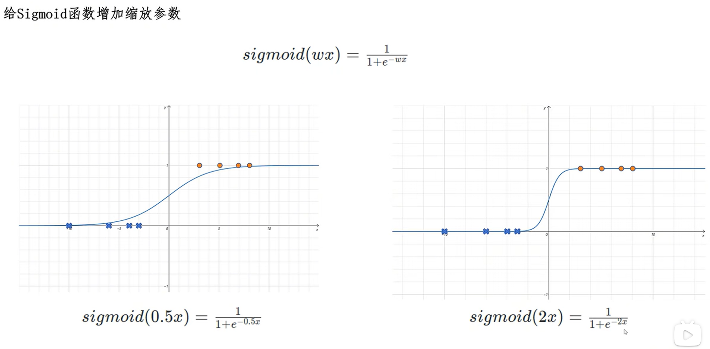

then we can add the bias b

it can be seen that logistic regression is to input the result of linear regression into the sigmoid function, and map it between 0 and 1

✅ if we represent it with a variable matrix and a parameter matrix, **general hypothesis function of logistic regression**(逻辑回归的通用假设函数) is achieved


how to understand the output of the hypothesis function?
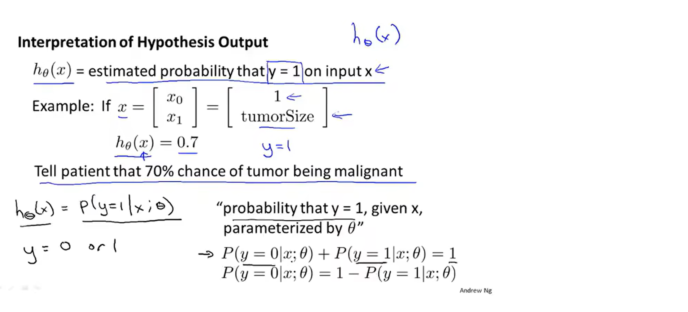

in python, we can achieve this function in this way:

```python
import numpy as np 
def sigmoid(z): 
 return 1 / (1 + np.exp(-z))
```

## 📌 decision boundary

the decision boundary(决策边界) can be a straight line

it can also be a curve(when there's higher-order term)
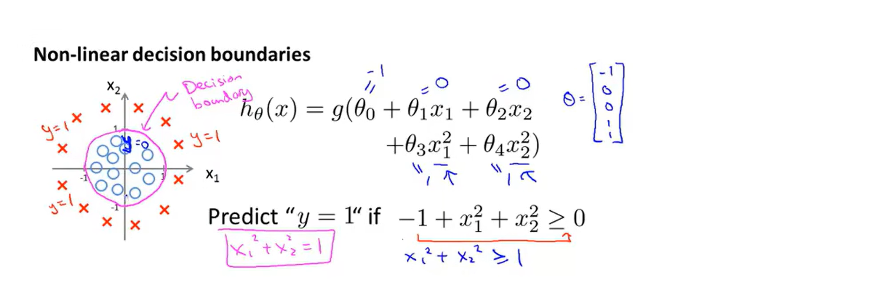

## 📌 cost function for Logistic Regression


for linear regression models, the cost function we define is the square error function<br>
theoretically speaking, we can follow this definition, but the hypothesis function of logistic regression is very complex, so the cost function we obtained wiil be a **non-convex function**(非凸函数)<br>
this means that our cost function has many local minimum, which will affect our using gradient descent algorithm to search for the global minimum
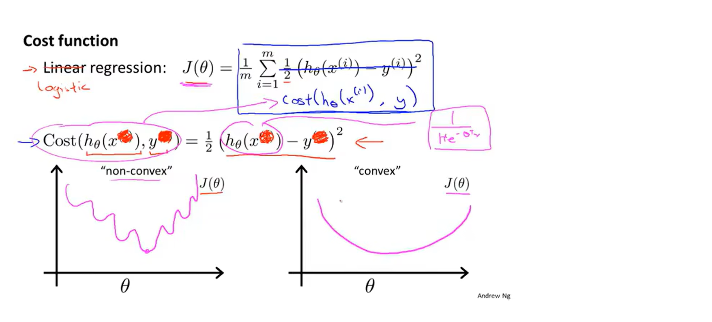

so, we change the cost function
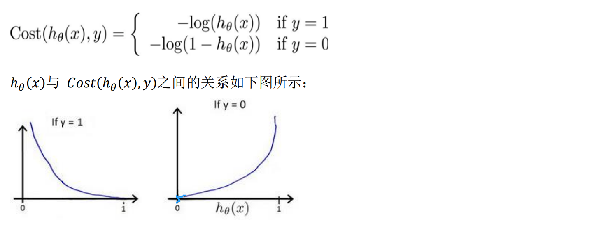


this cost function can be derived from the principle of **maximum likelihood estimation**(最大似然估计法)

so let's use gradient decent to see the minimum of cost function

pay attention that the h(x) here is the sigmoid function<br>
after calculating, we find that `the result is exactly the same as linear regression`!

## 📌 advanced optimization
just for knowing
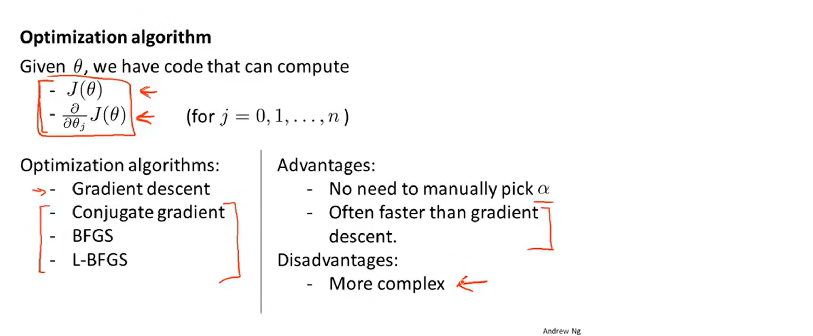

## 📌 multiclass classification
also called one-vs-all<br>
✅ turn multiclass into two classes!
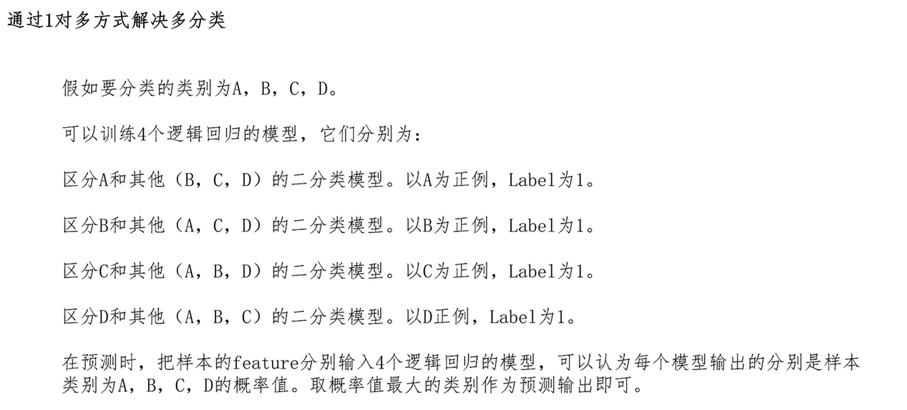

to visualize it, here's an example:
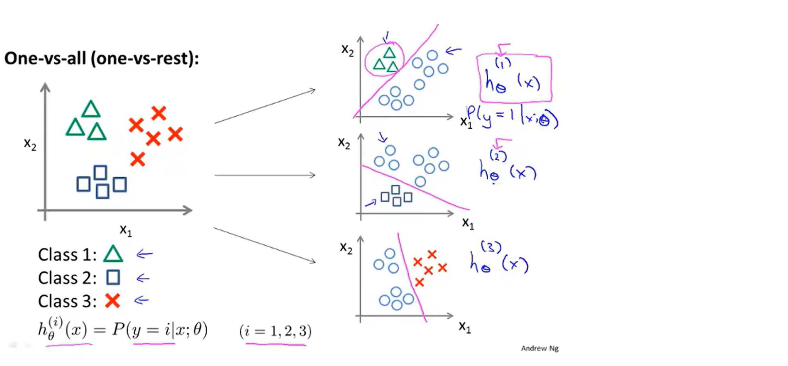

# Regularization
regularization(正则化) can reduce the problem of overfitting
## 📌 the problem of overfitting
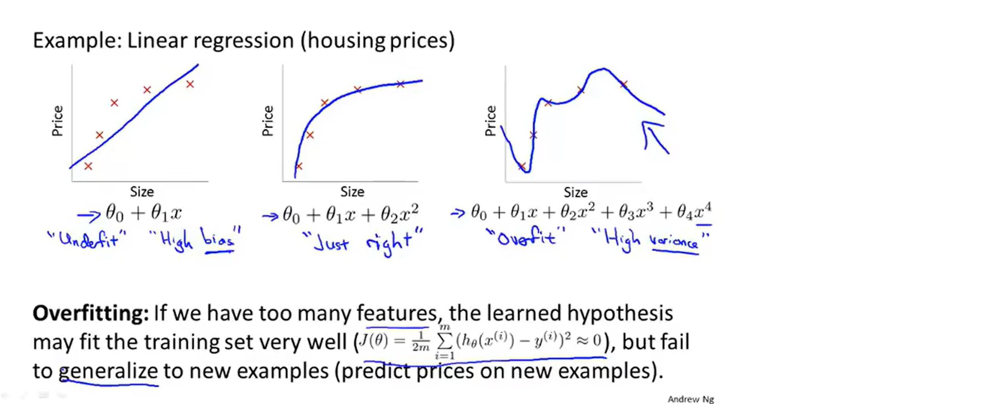
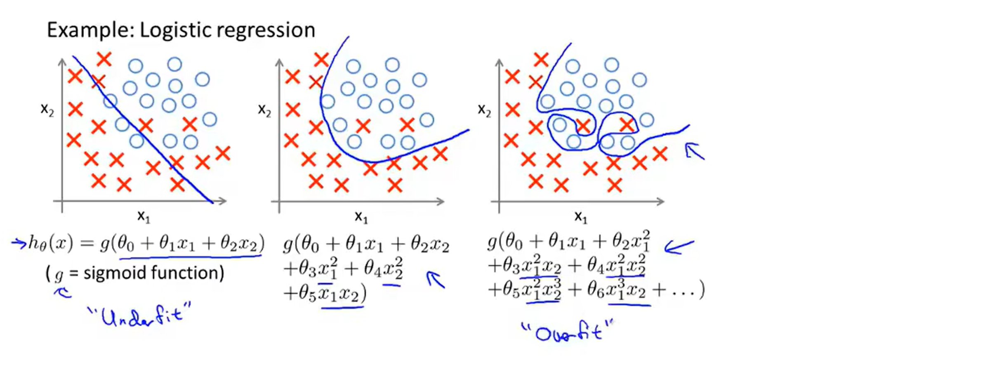
it can be seen that if the power(次幂) of x is too high, it may lead to overfitting

how to solve this problem?
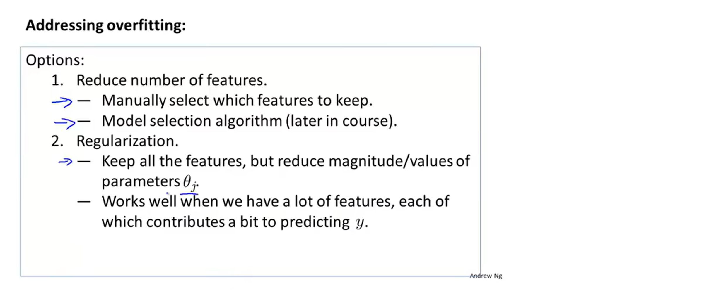

## 📌 cost function for Regularization
From the previous examples, we can see that if the power(次幂) of x is too high, it may lead to overfitting

so if the coefficients of these higher-order terms(高项式) approach 0, we can fit them very well

we can add prenalize(惩罚)


the value of regularization parameter is important
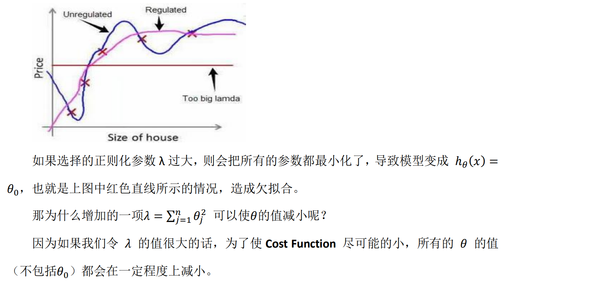

## 📌 regularized Linear Regression
gradient decent:
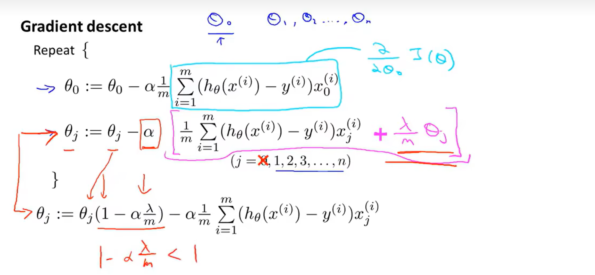

normal equation:
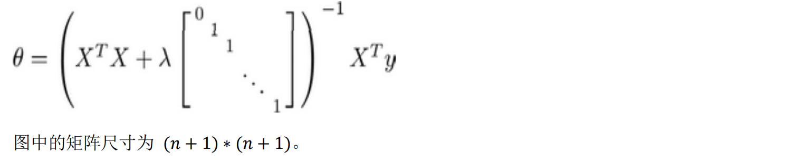

## 📌 regularized Logistic Regression
gradient decent:
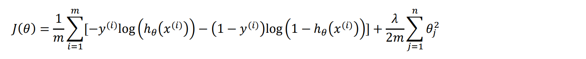
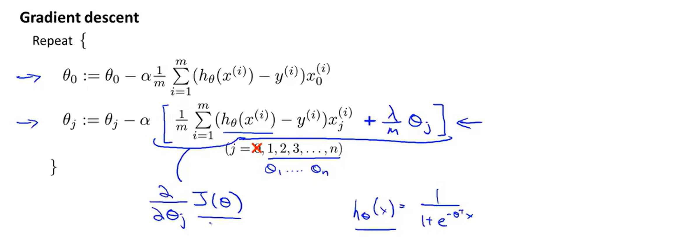

advanced optimization:
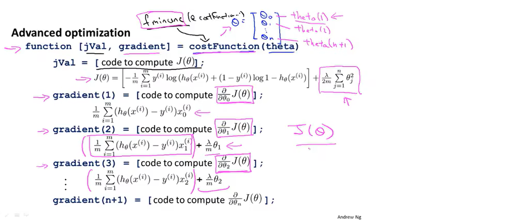
