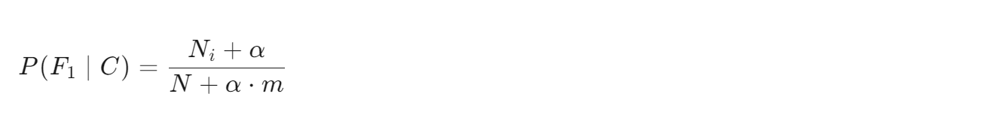

## 基础知识
### 贝叶斯公式


先验概率：事件发生的初始概率(C)

后验概率：在已知某些条件或证据(W)后，事件发生的修正概率

### 朴素贝叶斯
在贝叶斯的基础上，增加一个条件：**特征之间相互独立**

实际计算中，为了避免出现零概率情况，会增加（拉普拉斯）平滑系数

公式：


#### 📌 参数解释：

P(F1|C)：在类别C的条件下，特征F1出现的条件概率

Ni：类别C中，特征F1实际出现的次数

N：类别C中所有特征出现的总次数

m：独立特征的总数（特征空间的大小）

α：平滑系数，通常取1

#### 📌 举个例子：

假设你在做一个垃圾邮件分类器，类别 C 是“垃圾邮件”

总共有 1000 个词出现在垃圾邮件中（N=1000）

其中“免费”这个词出现了 20 次（Ni=20）

词汇表里共有 5000 个不同的词（m=5000）

平滑系数 α=1

那么：


## 实战案例
情感分类案例

根据商品评论内容判断情感倾向（好评/差评）

属于自然语言处理中典型的**分类问题**

### 流程分析
#### 📌 获取数据

``` python
# pd.read_csv读取csv文件数据，gbk用于中文编码
data = pd.read_csv('./data/书籍评价.csv', encoding = 'gbk')
```

#### 📌 数据预处理

##### 🔍 标签编码<br>
`机器学习的模型无法直接理解文本标签，所以需要把标签编码转化为数字`，我们将文本标签（"好评"/"差评"）转化为数值（1/0）<br>
``` python
data['labels'] = np.where(data['评价'] == '好评', 1, 0) # 条件搜索data中的评价，假如评价是好评，标号1，否则标号0
y = data['labels'] # 评价标号作为标签
```

##### 🔍 停用词处理：

概念：自然语言处理中的stop word，用于断句和去除无意义词汇

作用：如"我是一个..."中的"是"等连接词，通过停用词表过滤后可保留关键主语、谓语、宾语

实现：加载预定义的停用词表（如stopwords.txt）并进行去重处理<br>
``` python
stop_words = []
with open('./data/stopwords.txt', 'r', encoding = 'utf-8') as file:
  lines = file.readlines() # 按行读取
  stop_words = [line.strip() for line in lines] # 去除每行的空格
stop_words = list(set(stop_words)) # 转为集合去重，再转回列表
```

#### 📌 特征工程

##### 🔍 分词处理<br>
将完整句子切分为独立词语，`提取关键信息代表整条文本`，如"手机很好用"→["手机","很好","用"]<br>
``` python
# 导包
import jieba # 分词工具
# 使用
comment_list = [','.join(jieba.lcut(line)) for line in data['内容']] # 将分词后的每行用逗号连接
```

##### 🔍 词频统计<br>
统计各词语出现频率，`构建词频矩阵作为句子特征`<br>
``` python
# 导包
from sklearn.feature_extraction.text import CountVectorizer # 用来将文本转化为词频矩阵
# 使用
vectorizer = CountVectorizer(stop_words = stop_words)
X = vectorizer.fit_transform(comment_list) # 把comment_list放入scaler中分词
names = vectorizer.get_feature_names_out()
X = X.toarray()
```

#### 📌 模型构建

##### 🔍 算法选择<br>
有监督学习的分类问题，用朴素贝叶斯<br>
``` python
from sklearn.naive_bayes import MultinomialNB # 实现多项朴素贝叶斯分类器
```

##### 🔍 关键参数：alpha（平滑系数），用于处理零概率问题

### 代码实现

``` python
# 1.导包
import numpy as np  # 用于矩阵运算
import pandas as pd # 用于读取csv文本的数据
import jieba # 分词工具
from sklearn.feature_extraction.text import CountVectorizer # 特征提取，向量化计数
from sklearn.model_selection import train_test_split # 用于分割数据集
from sklearn.naive_bayes import MultinomialNB # 多项朴素贝叶斯
from sklearn.metrics import accuracy_score, classification_report # 用于模型评估

# 2.获取数据，数据预处理，特征工程
# 2.1 读取数据
data = pd.read_csv('.\data\书籍评价.csv', encoding = 'utf-8')
# 2.2 添加标签列
data['labels'] = np.where(data['评价'] == '好评', 1, 0) # 条件搜索data中的评价，假如评价是好评，标号1，否则标号0
y = data['labels'] # 评价标号作为标签
print(data)
# 2.3 设置停用词
stop_words = []
with open('./data/stopwords.txt', 'r', encoding = 'utf-8') as file:
  lines = file.readlines() # 按行读取
  stop_words = [line.strip() for line in lines] # 去除每行的空格
stop_words = list(set(stop_words)) # 转为集合去重，再转回列表
# 2.4 分词
comment_list = [','.join(jieba.lcut(line)) for line in data['内容']] # 将分词后的每行用逗号连接
# 2.5 词频统计
vectorizer = CountVectorizer(stop_words = stop_words)
X = vectorizer.fit_transform(comment_list) # 把comment_list放入scaler中分词
names = vectorizer.get_feature_names_out()
X = X.toarray()

# 3.数据集划分
X_train, X_test, y_train,y_test = train_test_split(X, y, test_size=0.2, random_state=1)

# 4.训练模型
# 实例化KNN模型
estimator = MultinomialNB(alpha=1)
# 训练模型
estimator.fit(X_train, y_train)

# 5.模型测试
y_pred = estimator.predict(X_test)

# 6.模型评估
print("Accuracy:", accuracy_score(y_test, y_pred))
print("Classification Report:")
print(classification_report(y_test, y_pred, zero_division=0))
```
