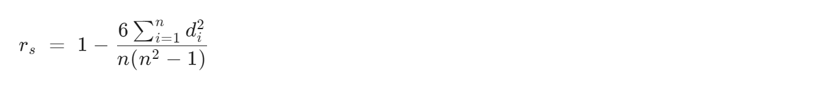

## 特征降维
降低特征维度，去除不重要的特征，提高模型的泛化能力

怎样的特征才是不重要的？<br>
低方差特征：波动范围小，信息量少，模型很难学习到信息<br>
相关性强的特征：相比强相关性的特征，独立存在、线性无关的特征能提供更多信息

常用方法：低方差过滤法，PCA，相关系数法

### 低方差过滤法
删除方差低于设定阈值的特征

#### 📌 关键参数
threshold：方差阈值<br>
作用：删除低于阈值的特征<br>
默认为0，因为方差大于等于零，所以就是保留了所有非零方差特征，删除具有相同值的特征

#### 📌 代码实现
``` python
# 导包
from sklearn.feature_selection import VarianceThreshold # 用于低方差过滤

# 特征工程（用低方差过滤法进行特征降维）
transformer = VarianceThreshold(threshold=0.1) # 低方差过滤器
X_train = transformer.fit_transform(X_train) # 放入数据，特征降维
X_test = transformer.transform(X_test) # 为防止数据泄露，测试集不能fit
```

### PCA(主成分分析)
压缩特征维度，降低复杂度

几何：将高维数据投影到低维平面（如3D→2D），通过统计指标（主要是方差）判断特征重要性<br>
代数：通过线性变换将原始特征转换为一组线性无关、方差最大的主成分

#### 📌 关键参数
n_components：<br>
小数形式（如0.95）：保留95%的信息量<br>
整数形式（如8）：保留8个特征<br>

#### 📌 实战案例
格式类似

``` python
# 导包
from sklearn.decomposition import PCA # 用于PCA

# 特征工程（用PCA进行特征降维）
transformer = PCA(n_components=0.95)
X_train = transformer.fit_transform(X_train) 
X_test = transformer.transform(X_test) 
```

### 相关系数法
谁和谁的相关性？有两种：<br>
特征与目标值间，保留相关性强的<br>
特征与特征间，保留不相关的（相关性弱的）

常见的相关系数：皮尔逊和斯皮尔曼

相关系数的值介于介于-1与+1之间，即r∈[-1,+1]<br>
|r|越接近1，线性关系越密切

#### 📌 皮尔逊相关系数
协方差COV/两标准差之积<br>
和数学里的相关系数ρ一样，自己变形展开

#### 📌 斯皮尔曼相关系数
先把原始数据转成等级：按大小顺序排列，碰到相同的值等级就取两者平均值，等级个数不变<br>
公式：

n为等级个数，d为两者等级差

#### 📌 两种相关系数对比
皮尔逊衡量`线性`相关程度，越接近正态分布越好<br>
斯皮尔曼衡量`单调`相关程度，可以是非线性

#### 📌 实战案例
``` python
# 导包
import pandas as pd
from scipy.stats import pearsonr # 皮尔逊
from sklearn.datasets import load_iris

# 导入数据
data = load_iris()
# 将数据转化为DataFrame格式
data = pd.DataFrame(data.data, columns = data.feature_names)

# 特征工程
# 用皮尔逊相关系数进行特征降维
corr = pearsonr(data['petal length (cm)'], data['petal width (cm)']) # 花瓣长度和宽度两个特征之间的相关性
print('皮尔逊相关系数：', corr[0], '不相关性概率：', corr[1])
```

输出结果：
``` python
皮尔逊相关系数： 0.9628654314027962 不相关性概率： 4.675003907326542e-86
```

分析：皮尔逊相关系数接近1，不相关概率接近0，因此两特征相关性极高，后续只保留一个即可。

类似的，斯皮尔曼只需要把pearsonr换成spearmanr即可。


